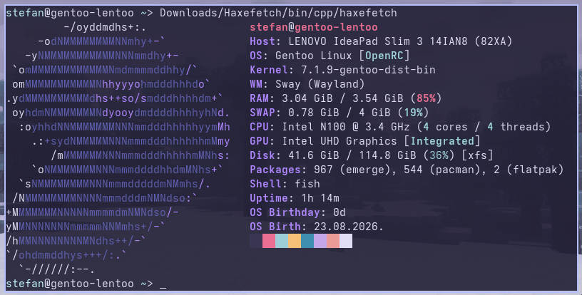
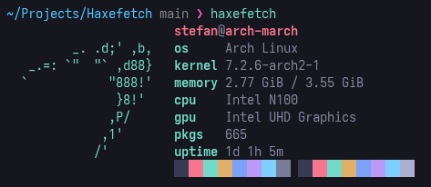
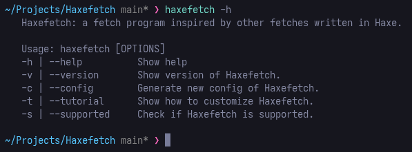
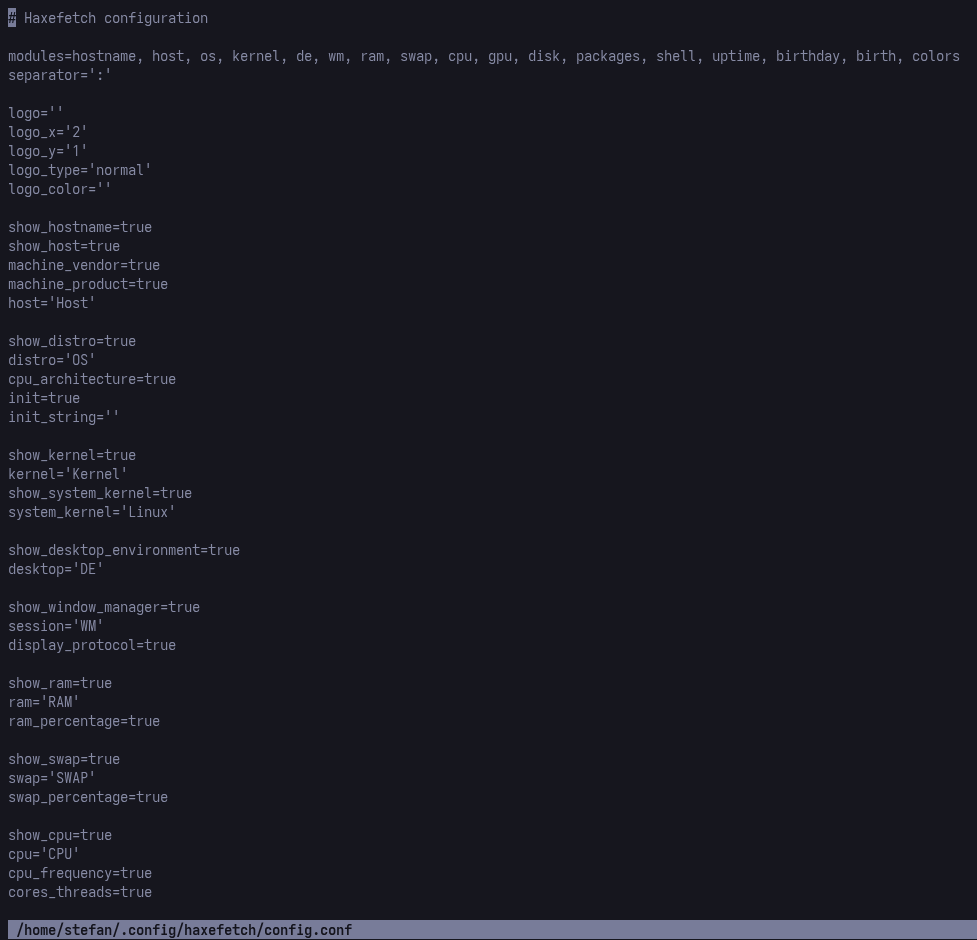

<p align="center">
  
</p>

<div align="center">
<br>


</div>

Haxefetch is fetch program inspired by fastfetch, neofetch, pfetch, nerdfetch, hyfetch, and so on written in Haxe. [Don't know what's Haxe? Read more](https://haxe.org/) and [learn Haxe if you don't know!](https://haxe.org/documentation/introduction/)

<p align="center">
  
</p>
<p align="center">
  
</p>
<p align="center">(Haxefetch preview)</p>

<p align="center">
  
</p>
<p align="center">(Haxefetch commands)</p>

<p align="center">
  
  
  
</p>
<p align="center">(Configuring Haxefetch with .conf and .hx support)</p>

## How to use this?

If you want to use, follow this:
<details>
    <summary>Getting a binary</summary>

Github releases with tarball
- [GH releases](https://github.com/Sbinator-hub/Haxefetch/releases)

For Arch Linux users
- I made [official Arch repo](https://github.com/Sbinator-hub/haxefetch-arch). Read more by clicking on "official Arch repo" text

For Fedora Linux users
- I made [official Fedora copr repo](https://github.com/Sbinator-hub/haxefetch-fedora). Read more by clicking on "official Fedora copr repo" text

For Gentoo Linux users
- I made [official overlay](https://github.com/Sbinator-hub/haxefetch-overlay) with included ebuilds. Read more by clicking on "official overlay" text

For NixOS users
- My friend [StaryPlemnik](https://github.com/Staryplemnik) made [official NixOS flake repo](https://github.com/Sbinator-hub/haxefetch-nix). Read more by clicking on "official NixOS flake repo" text

Getting compiled binary from Git using `wget`
```
wget https://raw.githubusercontent.com/Sbinator-hub/Haxefetch/main/binary/haxefetch && chmod +x haxefetch && sudo mv haxefetch /usr/bin/haxefetch
```

Getting compiled binary from Git using `wget` (FreeBSD)
```
wget https://raw.githubusercontent.com/Sbinator-hub/Haxefetch/main/binary/haxefetch-bsd && chmod +x haxefetch-bsd && doas mv haxefetch-bsd /usr/bin/haxefetch
```
> - NOTE: FreeBSD does supports compiled binary that i am pushing from Ubuntu 22.04 for compability! You need to do this steps: 1. Enable Linux module `doas kldload linux && doas kldload linux64` -> 2. Install Linux base image `doas pkg linux_base-r19` -> 3. Enable Linux service `doas sysrc linux_enable="YES` -> 4. Start service `doas service linux start`

</details>

<details>
    <summary>Getting Haxe and it's dependencies</summary>

- Install dependencies.

  - Debian/Ubuntu: 
    - ```
      apt-get install git g++ haxe
      ```

  - Fedora/RHEL/Rocky/Alma: 
    - ```
      dnf install git g++ haxe
      ```

  - openSUSE Leap/Tumbleweed:
    - ```
      zypper install git g++ haxe
      ```

  - Arch Linux: 
    - ```
      pacman -S base-devel git haxe
      ```

  - Gentoo Linux: 
    - ```
      emerge --ask --verbose (-av) dev-vcs/git sys-devel/gcc dev-lang/haxe
      ```
      > (if you have packages that are masked, [unmask them](https://wiki.gentoo.org/wiki/Knowledge_Base:Unmasking_a_package))

  - GNU Guix: 
    - ```
      guix install git gcc haxe
      ```

- Clone my repo.
  - ```
    git clone https://github.com/ACoolioDude/Haxefetch.git
    ```

- Setup development.
  - ```
    cd Haxefetch > haxelib setup > Set haxelib environent to Haxefetch folder 'home/$USER/Haxefetch/.haxelib' > install dependenices 'haxelib install all'
    ``` 
  
- Compile Haxefetch.
  - ```
    haxe build.hxml
    ```
</details>


